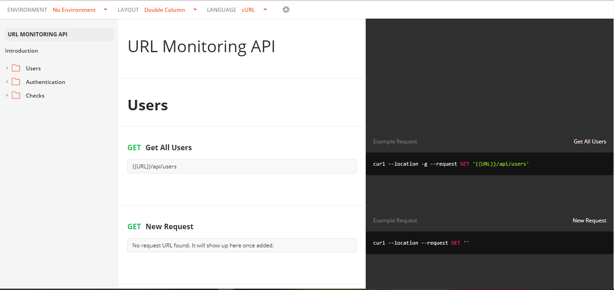

# urlmonitoring
build an uptime monitoring RESTful API server which allows authorized users to enter URLs they want monitored, and get detailed uptime reports about their availability, average response time, and total uptime/downtime.

# PostMan API test 
see documentation [here](https://documenter.getpostman.com/view/14845189/U16ht76X)

